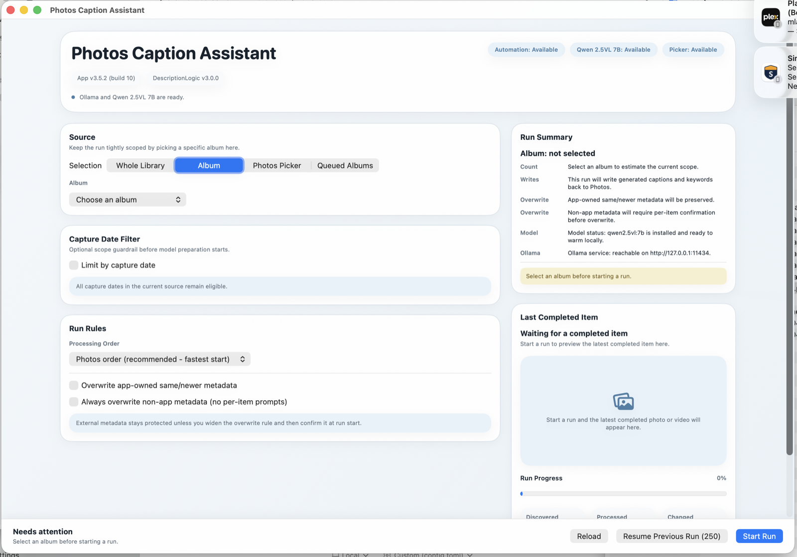
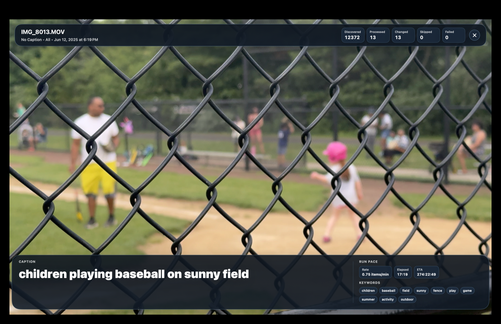

# Photos Caption Assistant

Photos Caption Assistant is a local-first macOS app for generating captions and keywords for Apple Photos items with a local Ollama vision model, then writing that metadata back into Photos.

This is a vibe-coded personal hobby app that I use on my own Mac and iterate on quickly. It is published so the source stays visible and recoverable, not because it is polished for broad public use. Outside usefulness is incidental. No support commitment, compatibility guarantee, stability promise, or warranty is implied beyond the repository's actual license situation.

The current source tree builds locally as version `3.5.2` build `10`.

## What It Does

- Reads photos and videos from Apple Photos.
- Generates a caption plus keyword set using a local Ollama model.
- Writes the generated metadata back into Photos.
- Supports `Album`, `Whole Library`, `Photos Picker`, and `Queued Albums` run modes.
- Shows a preflight summary before a run starts.
- Keeps a latest-completed-item preview on the main screen.
- Offers an immersive fullscreen preview while a run is in progress.
- Stores resumable run state and queued-album configuration locally on disk.

## Screenshots

Current main screen from a recent local run:



Current immersive preview from a recent local run:



## Requirements

- macOS 15 or later.
- Apple Photos installed.
- Photos.app open before starting a write run.
- A local Ollama installation.
- The `qwen2.5vl:7b` model installed locally, or willingness to let the app download it through Ollama after confirmation.
- User approval for Photos library access.
- User approval for Apple Events / automation access to Photos.

## Local-First Operating Model

- The app talks to a local Ollama service on `http://127.0.0.1:11434`.
- The app does not upload your library to a cloud service.
- The app does not auto-install Ollama and does not run remote install scripts.
- If Ollama is missing, the app can open the official macOS download page after explicit confirmation.
- If Ollama is installed but not running, the app can start it locally when needed.
- If the required model is missing, the app asks before downloading it.
- Photos metadata reads and writes still rely on Apple Photos automation and AppleScript-backed write paths.

## How To Use

1. Launch the app and grant Photos library plus Apple Events access when macOS asks.
2. Install Ollama if needed, then use `Re-check Setup` until the header shows automation, model, and picker availability correctly.
3. Choose a source:
   - `Album` for a targeted run.
   - `Whole Library` for the entire library.
   - `Photos Picker` for a hand-picked set of items.
   - `Queued Albums` for a saved multi-album queue.
4. If you use `Album`, the picker now warms up in two phases:
   - album names appear first
   - item counts fill in shortly afterward
5. Optionally add a capture-date filter.
6. Choose traversal order and overwrite rules.
7. Review the Run Summary panel carefully.
8. Start the run and watch the latest completed item update on the right.
9. Open `Immersive View` if you want the latest completed photo or video in fullscreen while the run continues.
10. Use `Retry Failed` or `Resume Previous Run` when those controls appear.

## What The App Actually Does During A Run

1. Checks local capabilities:
   - Photos automation
   - Ollama availability
   - model availability
   - picker capability
2. Resolves the selected run scope.
3. Reads existing metadata from Photos so overwrite policy can stay conservative.
4. Acquires analysis input for each item.
5. Sends that input to the local Ollama vision model.
6. Receives a generated caption plus keywords.
7. Applies overwrite rules and, when required, asks for confirmation before touching non-app metadata.
8. Writes the final caption, keywords, and app ownership tags back to Photos.
9. Persists resumable state so interrupted runs can be resumed later.

## Photo And Video Input Details

For photos, the app does not normally fetch a separate high-resolution asset just to power immersive preview.

- The preferred photo path is a local preview JPEG, capped at `2048px`, requested through Photos with network access disabled.
- That same acquired photo input is reused for analysis and for the completed preview / immersive view.
- If that local preview path fails, the app can still fall back to a fuller export path once for the run item.
- Immersive preview then reuses the file or data already acquired for that item instead of refetching a larger version just for display.

Videos still use a local export/acquire path that is appropriate for video analysis and preview generation.

## Run Modes

### Album

- Best default for safety.
- Tightest scope.
- Picker becomes usable as soon as album names arrive, even if counts are still loading.

### Whole Library

- Available, but intentionally guarded.
- Requires confirmation before write work starts.

### Photos Picker

- Uses the system picker.
- Good for small manual batches.

### Queued Albums

- Stores a reusable ordered queue of albums.
- Validates duplicate or missing queue selections before the run starts.
- Good for recurring multi-stage workflows.

## Safety Defaults

- Startup defaults to `Album`, not whole library.
- Overwriting non-app metadata without per-item prompts is off by default.
- The app shows a visible run summary before starting.
- Whole-library runs require confirmation.
- No-prompt overwrite of non-app metadata requires confirmation.
- Missing-model downloads require confirmation.

## Main UI Notes

- The main screen uses a denser two-column workbench layout.
- Setup controls are on the left.
- Run Summary plus latest completed item are on the right.
- The album picker now has explicit loading states instead of appearing dead while Photos and PhotoKit warm up.
- The immersive button now shows `Opening…` during fullscreen handoff so it feels responsive instead of inert.

## Immersive View Notes

- Wide landscape media keeps the overlay-style top HUD plus low-cover bottom dock.
- Tighter or trickier aspect ratios can fall back to the bottom-shelf layout so chrome stays visible.
- Empty immersive state now shows only centered copy until there is a completed item to display.
- Aspect-fit media uses a restrained ambient matte instead of a flat black letterbox.
- Capture dates are now interpreted in the Mac's local time zone instead of drifting through the earlier pseudo-epoch conversion.

## Data And Storage

Persistent state lives here:

- `~/Library/Application Support/PhotosCaptionAssistant/run_resume_state.json`
- `~/Library/Application Support/PhotosCaptionAssistant/caption_workflow_configuration.json`

On first launch after the app rename, the app copies forward known persistent state from the old `PhotoDescriptionCreator` Application Support folder if the new folder does not exist yet. The old files are left in place.

Temporary outputs are created under the current temp directory in folders such as:

- `PhotosCaptionAssistantBenchmarks`
- `PhotosCaptionAssistantLastCompleted`
- `PhotosCaptionAssistantExports`
- `PhotosCaptionAssistantVideoExports`
- `PhotosCaptionAssistantPreviews`

The app includes menu-accessible `Data & Storage` and `Diagnostics` windows. `Data & Storage` shows important local paths, can open the data folder, and can clear only the resumable run-state snapshot.

## Building

Local verification:

```bash
swift test
swift build -c release --triple arm64-apple-macosx15.0 --product PhotosCaptionAssistant
swift build -c release --triple x86_64-apple-macosx15.0 --product PhotosCaptionAssistant
./scripts/build_app.sh
```

`./scripts/build_app.sh`:

- increments the patch version
- increments the build number
- builds separate `arm64` and `x86_64` release binaries
- merges them into one universal executable with `lipo`
- packages the app into `dist/Photos Caption Assistant.app`
- ad-hoc signs the bundle
- verifies the resulting signature

This repo is source-first. Built app bundles and temp outputs should not be treated as source-of-truth artifacts.

## Opening The Built App On macOS

The packaged app is ad-hoc signed for local use, but it is not notarized for public distribution. macOS may warn when you open it.

Preferred opening flow:

1. In Finder, locate `dist/Photos Caption Assistant.app`.
2. Control-click the app and choose `Open`.
3. Click `Open` again if macOS asks.

If macOS still blocks launch:

1. Try opening it once from Finder.
2. Open `System Settings > Privacy & Security`.
3. Find the blocked-app message near the bottom and choose `Open Anyway`.

Because the bundle identifier is now `com.jkfisher.PhotosCaptionAssistant`, macOS may prompt again for Photos and Apple Events permissions even if you previously approved the older app identity.

## CI

The repository includes a GitHub Actions CI workflow that runs tests and release builds on `macos-15`. It now uses `actions/checkout@v5`, which is the Node 24-compatible line needed to avoid the Node 20 deprecation warning on GitHub-hosted runners.

## Known Limits

- This is still a hobby app, not a polished public-distribution product.
- It is still heavily shaped by fast local iteration and vibe-coding, so expect rough edges.
- The production write path still depends on Apple Photos automation, which can be fragile on long runs.
- Photos.app must be open before starting a write run.
- The app is not notarized.
- The app is not a cloud product, collaboration tool, or background sync agent.
- The app has no formal support promise.

## Repository Truthfulness Notes

- Both screenshots above are from recent local app runs.
- If those visuals drift from the actual app again, the README should be updated instead of pretending they are still exact.
